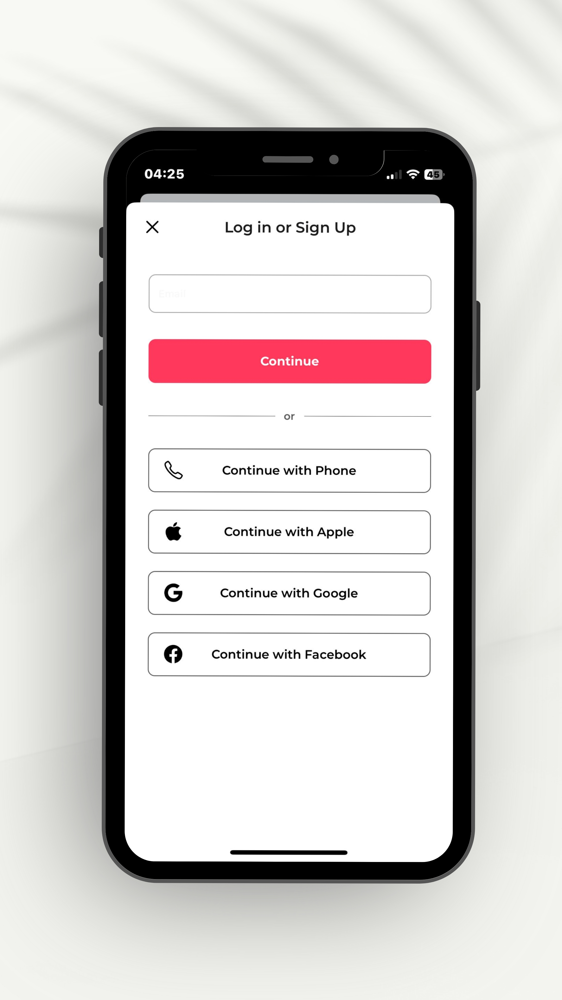
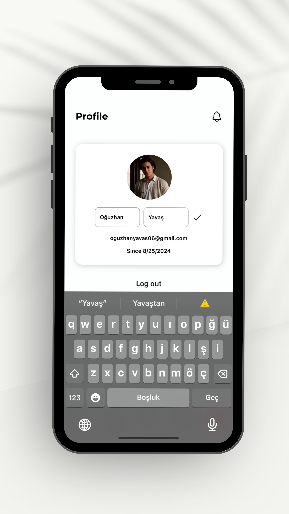
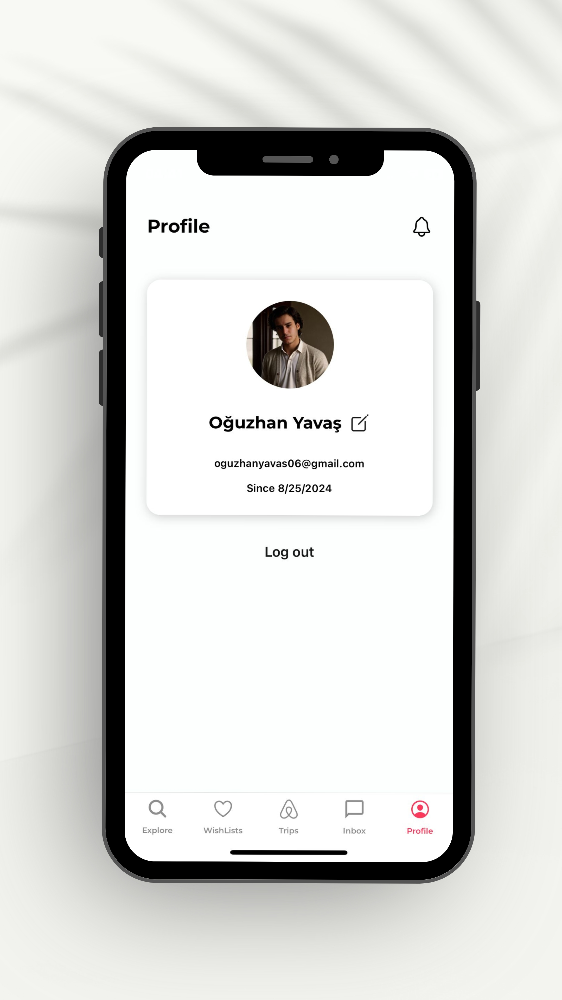
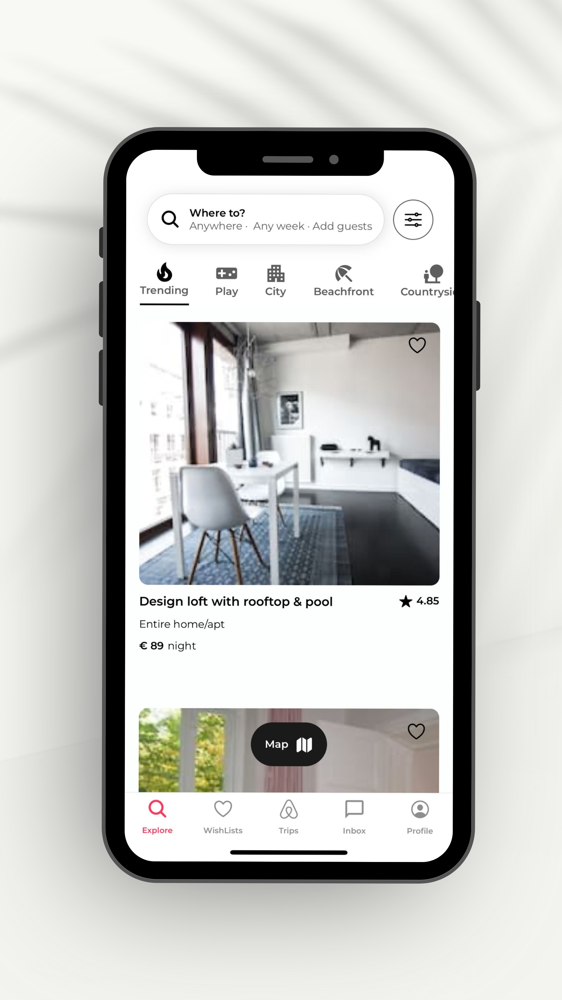
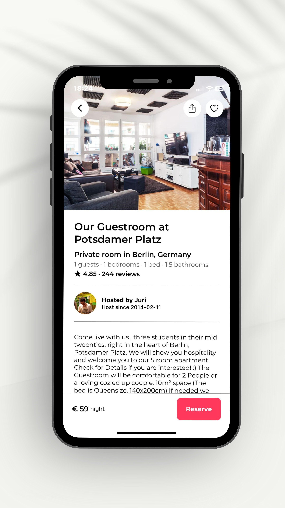
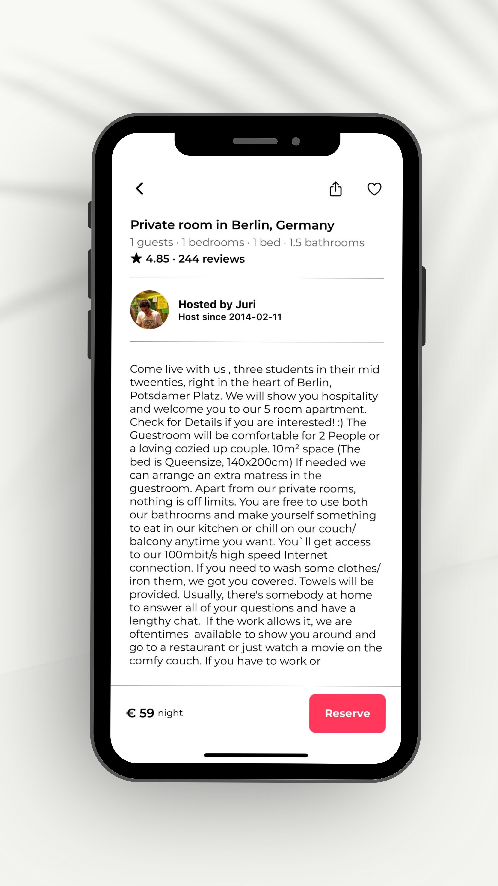
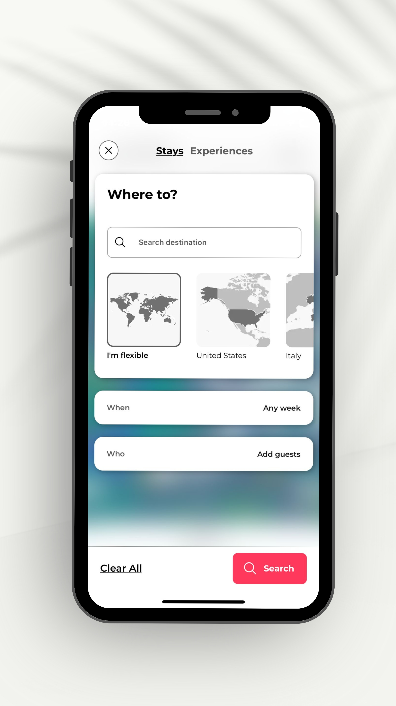
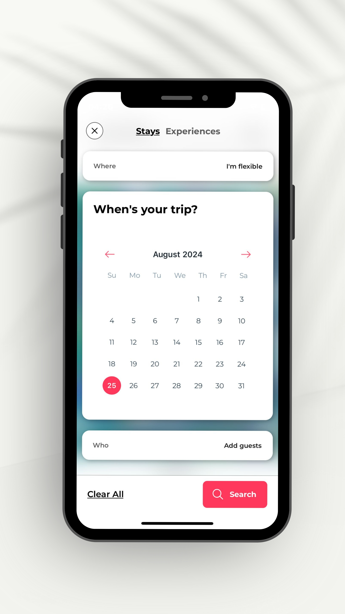
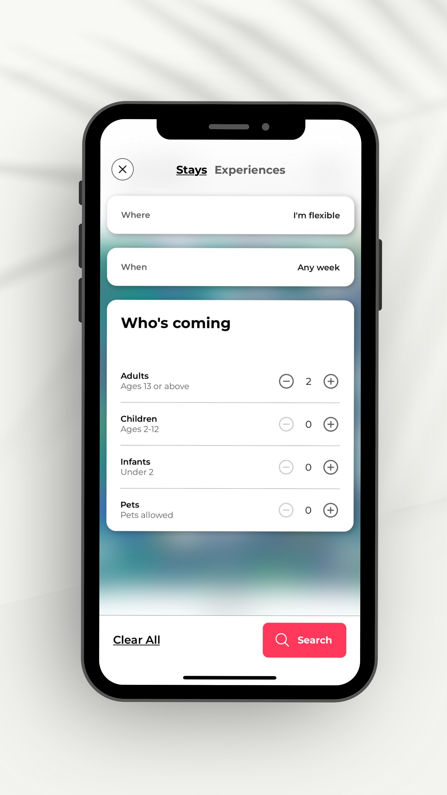
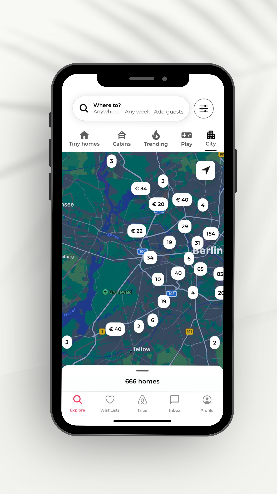

# React Native AirBnB Clone with Clerk

This is a React Native AirBnB clone application, utilizing **Clerk** for seamless user authentication and providing a rich feature set that mirrors the core functionalities of the original AirBnB app. The project is built with modern tools and libraries to ensure a smooth and efficient development experience.

## Features

- **User Authentication with Clerk:**
  - Secure and robust user authentication using Clerk.
  - Support for Google & Apple Sign-In for seamless user onboarding.

- **Expo Router for File-Based Navigation:**
  - Simplifies navigation by leveraging Expo's file-based routing system.

- **Advanced Animations with Reanimated 3:**
  - Smooth and fluid animations using Reanimated 3 for an enhanced user experience.

- **Map Integration:**
  - Includes `MapView` with markers and clustering to display properties on a map.
  
- **Interactive Bottom Sheet:**
  - A draggable bottom sheet component for displaying additional details and options.

- **Modal with Animations and Blurred Background:**
  - Enhanced modals with smooth animations and blurred backgrounds for a polished UI.

## Screenshots

Here are some screenshots showcasing different parts of the application:

| Sign In - Sign Up | Profile | Profile Edit |
|-------------------|---------|--------------|
|  |  |  |  |

| Home Modal | Property Details |
|------------|------------------|
|  |  |  |

### Booking Screen

<table>
  <tr>
    <td></td>
    <td></td>
    <td></td>
  </tr>
</table>

| Map View |
|----------|
| 

## Demo

Check out the live demo of the application in action:

[Demo Video](<a href=https://www.linkedin.com/feed/update/urn:li:activity:7233512069298352129/ />)

## Installation

To get started with this project, follow these steps:

1. Clone the repository:

   ```bash
   git clone https://github.com/oguzhanyavass/airbnb-clone-app.git
